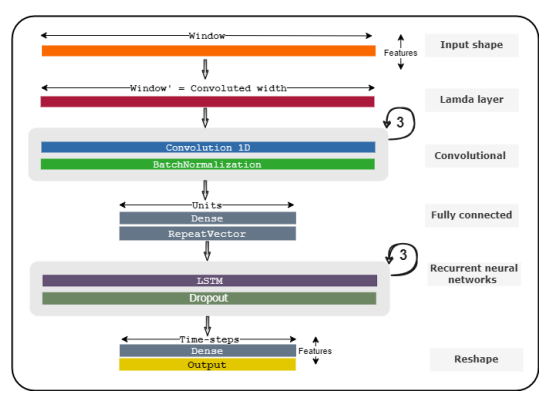

# FedCampus APP Development

An application to the FedCampus Platform

This is an application and practice of our FedCampus platform, where we
want to use the health data from edge users to do federated learning as
well as federated analysis. My job in the project is mainly developing
the basics of an app, fetching data from Huawei Health Kit,
communicating with FedCampus platform and doing federated analysis.

**App Development**

- Getting data from Huawei

- Send them (raw + noised) to backend

- Simple UI

**Project Architecture**

By using wearable devices, the users’ data are recorded and sent to the
Huawei HealthKit, and our FedCampus App can get the data from Huawei
HealthKit to do federated learning and federated analysis.

**Model Structure**

Our model is a variation of FedMCRNN where we take the distance,
calories, walking minutes, high-moderate intensity minutes, elevation
gain, static heart rate, exercise heart rate of 7 days as input (7x8),
and predict the sleep efficiency as output.
